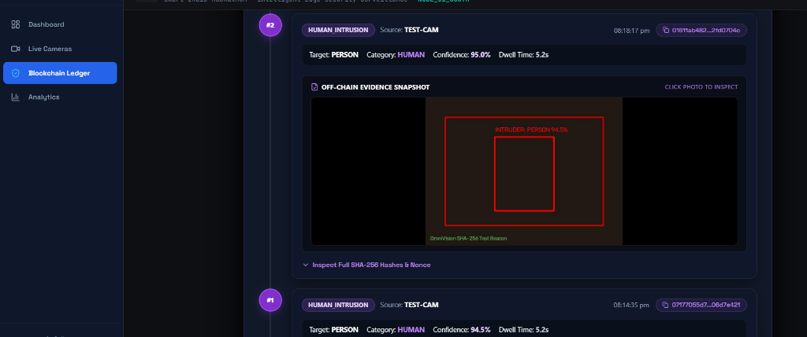
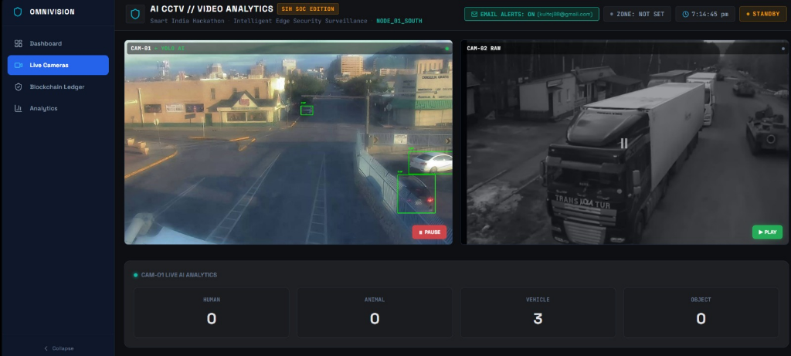

# OmniVision // IBVAP — Intelligent Blockchain Video Analytics Platform
### Smart India Hackathon (SIH) SOC Edition


---

## 🚨 Problem Statement

High-density security surveillance infrastructure suffers from human operator fatigue, high video stream latency, lack of automated threat filtering, and vulnerability to evidence tampering. Traditional NVR systems provide zero cryptographic proof of evidence chain-of-custody, making recorded video easily challenged or disqualified in legal proceedings. Standard surveillance setups lack edge-based real-time ANPR/OCR, customizable multi-polygon virtual boundaries, and instant multi-channel alert dispatches with snapshot verification. Neural AI models deployed on edge devices are susceptible to weight corruption, lens tampering, and unauthorized adversarial manipulation without automated integrity auditing. Legacy surveillance architectures cannot scale efficiently across multi-camera SOC environments while maintaining low latency and zero-trust data verification.

---

## 💡 Our Solution

**OmniVision (IBVAP)** is an enterprise-grade, high-performance security intelligence Security Operations Center (SOC) platform designed for real-time edge video analytics and legal-grade evidence verification:

1. **Edge AI Detection & Tracking**: Real-time YOLO object classification (`HUMAN`, `VEHICLE`, `ANIMAL`, `OBJECT`) with persistent ByteTracker identity tracking.
2. **Interactive Virtual Boundaries**: User-drawn polygon zones with automatic point-in-polygon entry checks and 5-second dwell time cooldown logic.
3. **ANPR & OCR License Plate Extraction**: Automatic license plate candidate detection and OCR text parsing for security checkpoints.
4. **Lens Tamper Anomaly Detection**: Real-time Laplacian variance monitoring detecting camera covering, spray attacks, or lens obstruction within 100ms.
5. **Immutable Forensic Blockchain Ledger**: SHA-256 Proof-of-Work blockchain anchoring every security intrusion event and off-chain photo evidence SHA-256 hash.
6. **AI Model Weight Integrity Protection**: Live neural model hash verification detecting unauthorized model weight corruption and restoring signed weight anchors.
7. **Multi-Channel Alert Dispatch**: Automated perimeter breach alerts with annotated photo snapshot evidence delivered via email.

---

## 📸 Prototype Showcase

### 1. Forensic Blockchain Evidence Ledger (Royal Amethyst Glass UI)
> *Cryptographically verified event history featuring SHA-256 Proof-of-Work block cards, neural weight anchor proof, off-chain snapshot inspection lightbox, and tamper simulation controls.*



***

### 2. Multi-Camera Live Analytics Grid & Surveillance SOC
> *Multi-viewport live camera feed with real-time YOLO bounding box telemetry, camera switching controls, and active object class summaries.*



---

## 🏛 System Architecture

```
                                  ┌─────────────────────────────────────────┐
                                  │           React 18 Frontend             │
                                  │      (Vite + Glassmorphism UI)          │
                                  └────┬──────────────────────────────┬─────┘
                                       │                              │
                            MJPEG Stream (HTTP GET)          WebSocket (WS Telemetry)
                                       │                              │
                                  ┌────▼──────────────────────────────▼─────┐
                                  │           FastAPI Backend Server        │
                                  │          (Python / OpenCV Engine)       │
                                  └────┬──────────────┬───────────────┬─────┘
                                       │              │               │
                    ┌──────────────────┴──┐    ┌──────┴───────┐   ┌───┴──────────────────┐
                    │ Multi-Source Stream │    │ YOLO AI Engine│   │ Camera Tamper Engine │
                    │ (Webcam/HTTP/RTSP)  │    │  & OCR Reader│   │ (Laplacian Variance) │
                    └─────────────────────┘    └──────┬───────┘   └──────────────────────┘
                                                      │
                                           ┌──────────▼──────────┐
                                           │  Virtual Boundary   │
                                           │  Polygon Manager    │
                                           └──────────┬──────────┘
                                                      │
                                           ┌──────────▼──────────┐
                                           │  SHA-256 Forensic   │
                                           │  Blockchain Ledger  │
                                           └─────────────────────┘
```

---

## ⚡ Architecture & Upgrade Roadmap

| Module | Current Baseline Implementation | Enterprise Target Upgrade |
|---|---|---|
| **Object Detection** | YOLO-World / YOLO11n on CPU (30 FPS) | YOLOv8-Large + GPU CUDA (< 3ms inference) |
| **ANPR / OCR** | EasyOCR license plate candidate parser | PaddleOCR GPU pipeline (5× speedup) |
| **Virtual Boundary** | Custom polygon zone + 5s dwell timer | Multi-zone priority rules & per-zone schedules |
| **Alerts & Dispatch** | Async email with annotated snapshot | Multi-channel WhatsApp + Telegram + Web Push |
| **Object Tracking** | ByteTracker track_id dwell tracking | DeepSORT with ReID surviving heavy occlusion |
| **Tamper Detection** | Laplacian variance lens cover detection (100ms) | Spray & camera shake anomaly detection |
| **Forensic Ledger** | In-memory SHA-256 Proof-of-Work blockchain | Private Hyperledger Fabric / Ethereum L2 consortium |
| **Model Security** | AI model weight SHA-256 integrity anchor | TPM 2.0 / Hardware Security Module (HSM) signing |
| **Concurrency** | Non-blocking ThreadPoolExecutor workers | Celery + Redis distributed task queues |
| **Frontend UI** | React 18 Glassmorphic SOC Terminal | Incident video replay & interactive map GIS |

---

## 🚀 Quick Start Guide

### Prerequisites
- Python 3.10+
- Node.js 18+ and `npm`

### 1. Backend Setup

```bash
cd backend

# Create & activate virtual environment
python -m venv venv
venv\Scripts\activate          # Windows
# source venv/bin/activate     # Linux / Mac

# Install Python dependencies
pip install -r requirements.txt

# Start the FastAPI server
python -m uvicorn main:app --reload --host 0.0.0.0 --port 8000
```
> *Note: YOLO model weights (`yolo11n.pt` / `yolov8n.pt`) auto-download on first startup.*

### 2. Frontend Setup

```bash
cd frontend

# Install Node dependencies
npm install

# Start Vite development server
npm run dev
```

Open your browser at **http://localhost:5173**

---

## 🌐 Deploying Frontend to Vercel

The frontend includes a pre-configured [`vercel.json`](frontend/vercel.json) for 1-click deployment.

### Option A: Via Vercel CLI
```bash
cd frontend
npx vercel
```

### Option B: Via GitHub Dashboard
1. Push repository to GitHub.
2. Go to [Vercel Dashboard](https://vercel.com/new) and import the repository.
3. Set **Root Directory** to `frontend`.
4. Build Command: `npm run build`, Output Directory: `dist`.
5. Click **Deploy**.

---

## 📁 Repository Structure

```
SIHCCTV/
├── backend/
│   ├── main.py                     ← FastAPI REST API, MJPEG stream, WebSocket handler
│   ├── video_stream.py             ← Threaded VideoCapture (Webcam, HTTP, RTSP)
│   ├── detector.py                 ← YOLO object detection & category mapping
│   ├── boundary.py                 ← User polygon zone management & point-in-polygon
│   ├── alerts.py                   ← Intrusion cooldown & alert log queue
│   ├── ocr_reader.py               ← EasyOCR license plate candidate extraction
│   ├── email_notifier.py           ← Async email alert dispatch with photo snapshot
│   ├── blockchain.py               ← Blockchain router & SHA-256 API endpoints
│   └── blockchain/
│       ├── event_ledger.py         ← Proof-of-Work block mining & chain validation
│       └── event_hasher.py         ← SHA-256 event payload & photo hashing
│
├── frontend/
│   ├── vercel.json                 ← Vercel deployment configuration
│   └── src/
│       ├── App.jsx                 ← Main SOC layout container
│       ├── config.js               ← Dynamic API & WS environment config
│       ├── index.css               ← Royal Amethyst & Glassmorphism design system
│       └── components/
│           ├── GlobalSidebar.jsx   ← Primary navigation sidebar
│           ├── DemoCameraGrid.jsx  ← Multi-camera live view grid
│           ├── VideoDisplay.jsx    ← Live MJPEG optical stage & canvas overlay
│           ├── BoundaryControls.jsx← Polygon drawing tools
│           ├── BlockchainLedgerPanel.jsx ← Royal Amethyst forensic ledger
│           ├── AnalyticsPanel.jsx  ← Leaflet map & telemetry log analytics
│           └── EmailAlertModal.jsx ← Perimeter alert email configuration
│
└── docs/
    └── screenshots/                ← Prototype screenshots & UI assets
```

---

## 📜 License & Compliance

Developed for **Smart India Hackathon (SIH)**. Distributed under the MIT License.
